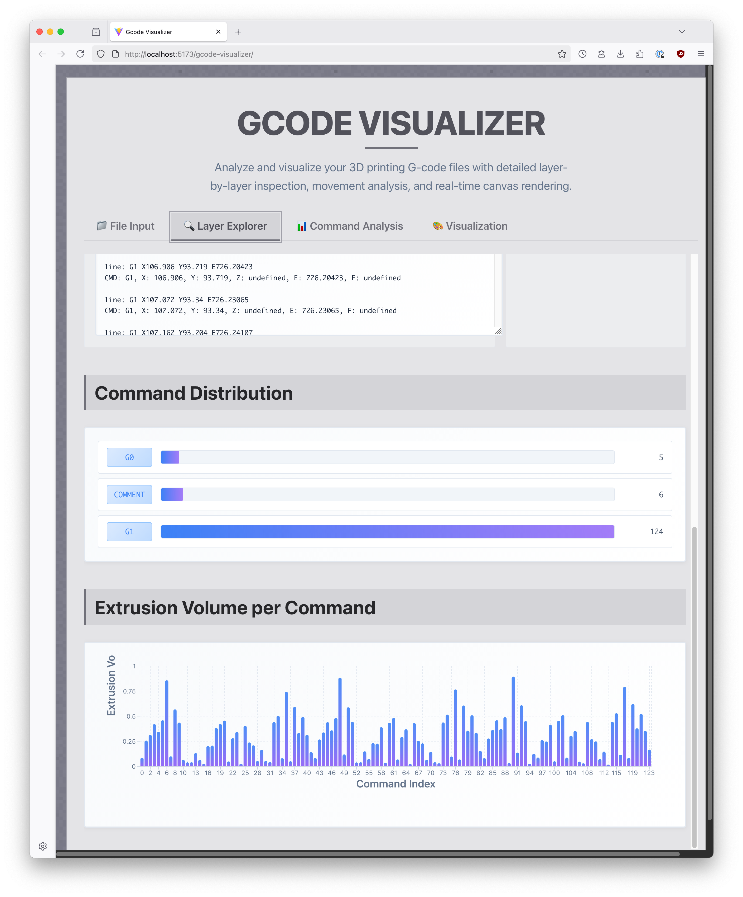
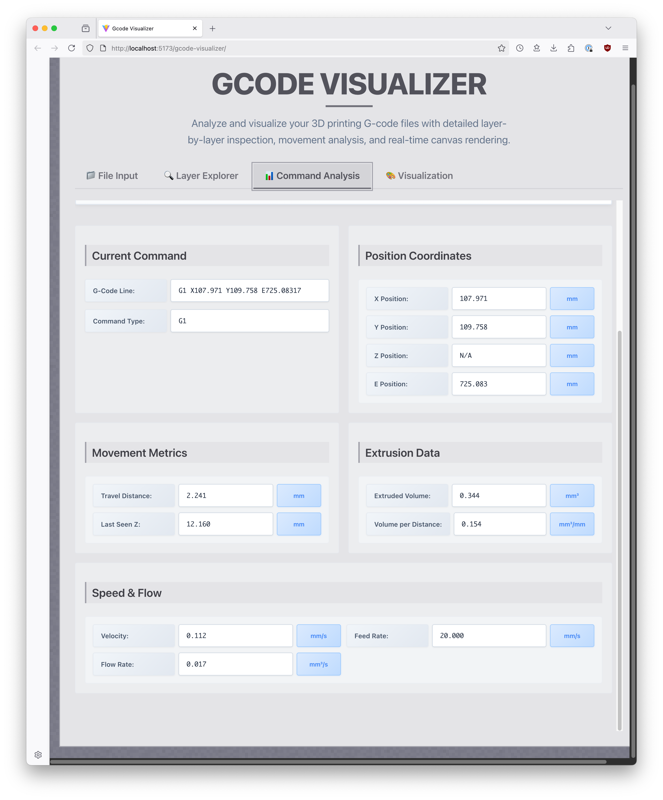
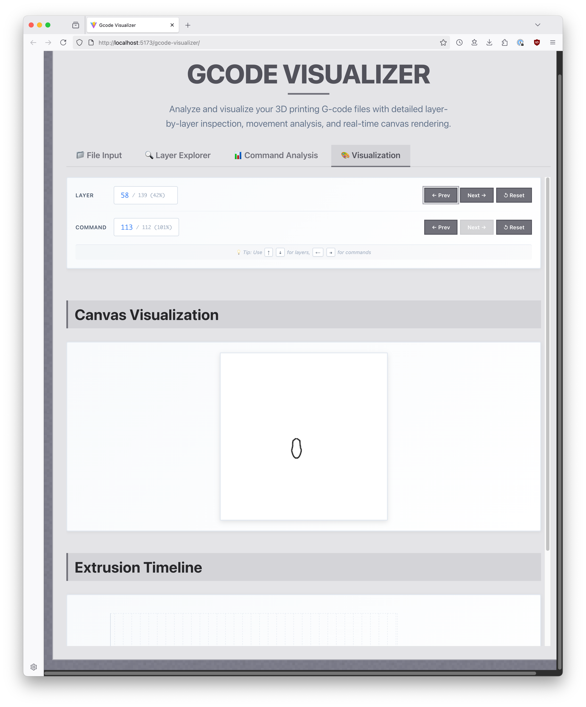

# G-Code Visualizer

A web-based tool for visualizing and analyzing G-code commands from 3D printers, CNC machines, laser cutters, and other fabrication equipment.

## 🔗 Live Demo

**[https://mauricioize.dev/gcode-visualizer](https://mauricioize.dev/gcode-visualizer)**

## 🖼️ Screenshots

| Screenshot |
|------------|
|  |
|  |
|  |

## 📋 Overview

G-Code Visualizer helps you understand and optimize your fabrication workflows by providing detailed analysis of G-code files. 
Simply drop your `.gcode` file from popular slicers (like UltiMaker Cura, PrusaSlicer, or others) and get instant analytical insights including:

- **Extrusion volume calculations** per command and layer
- **Speed and flow analysis** for movement optimization
- **Layer-by-layer visualization** with interactive navigation
- **Command distribution statistics** for better understanding of your prints
- **Canvas rendering** to visualize toolpaths

