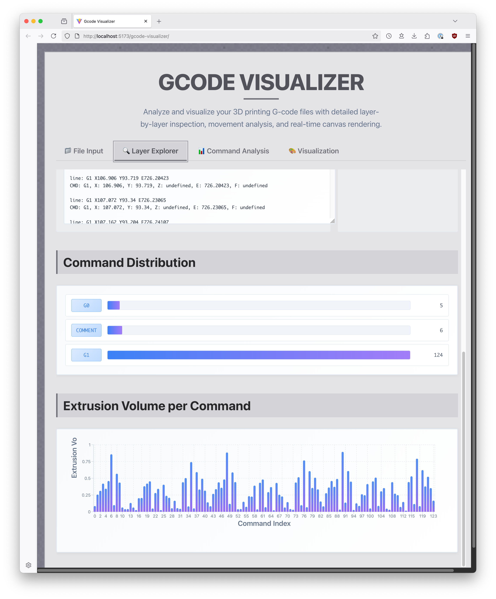
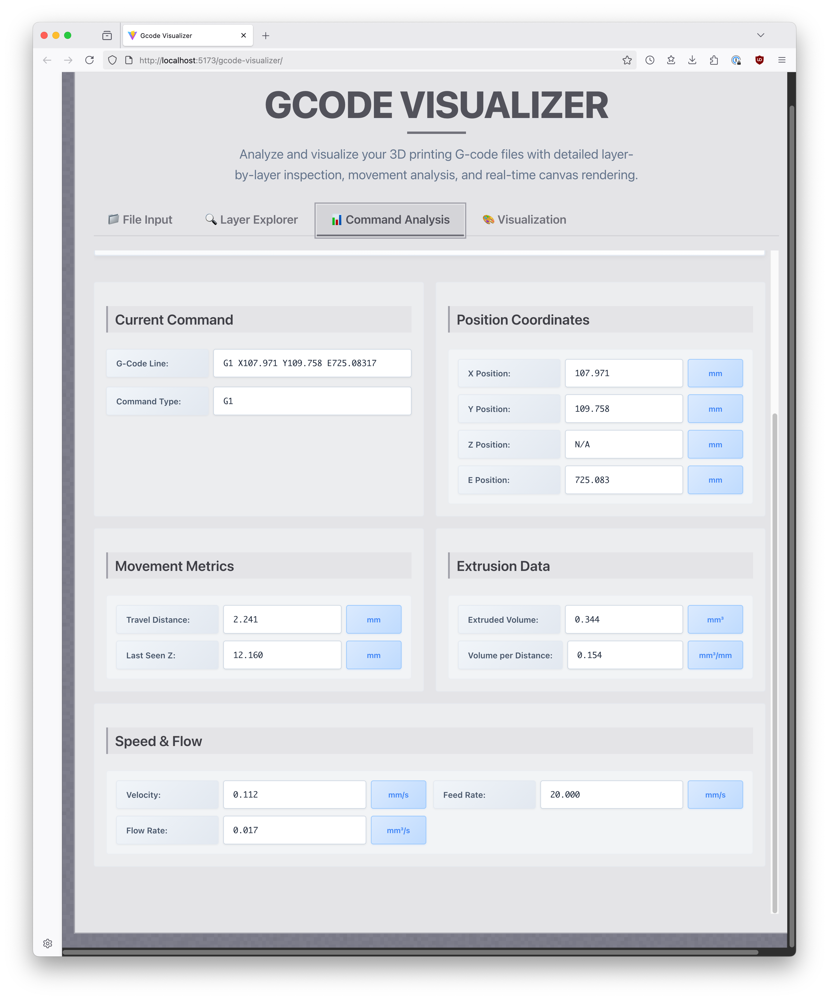
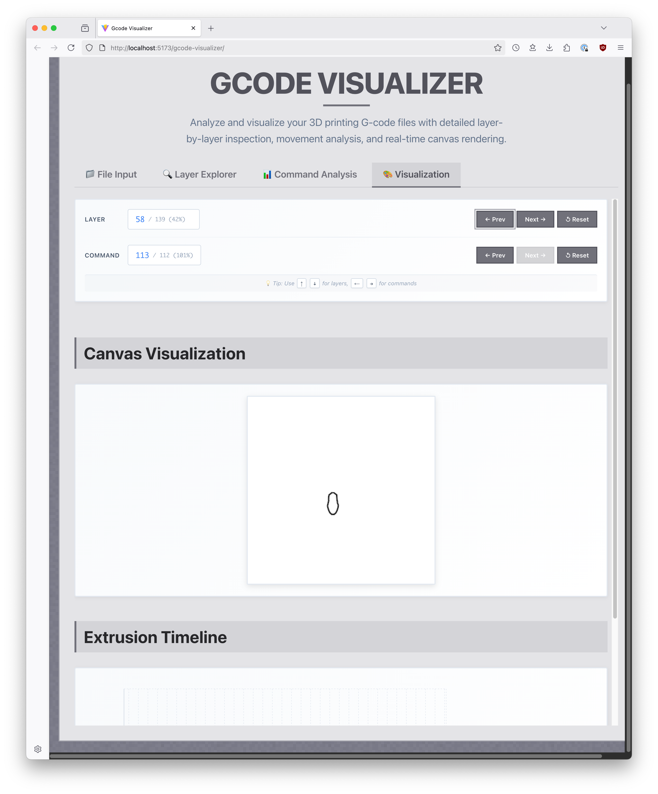

# G-CODE-VISUALIZER

A web app tool for visualizing and analyzing G-code commands from 3D printers, CNC machines, laser cutters, and other fabrication equipment.

### LIVE DEMO

**[https://mauricioize.dev/gcode-visualizer](https://mauricioize.dev/gcode-visualizer)**

### SCREENSHOTS

| Screenshot                                    |
| --------------------------------------------- |
|  |
|  |
|  |

### USAGE

Simply drop your `.gcode` file from popular slicers (like UltiMaker Cura, PrusaSlicer, or others).
Or press the button to load a built-in g-code file example.

- **Extrusion volume calculations**
- **Speed and flow analysis**
- **Layer-by-layer visualization**
- **Command distribution statistics**
- **Canvas rendering** to visualize needle path

NOTE: THis was personally tested only on UltiMaker Cura 5.2.

### MOTIVATION

As a former owner of an Ender 3 printer, which is famous for challenging you with various technical issues, I was looking for a tool to help me analyze specific commands.

### STACK

- Vite
- TypeScript
- React
- Custom components using styled-components
- A few shadcn components
- HTML Canvas + 2D Context API
- recharts
- Basic navigation with hard-coded routes for each tab
- React context to handle state communication between the tabs

### BACKLOG

- Add some UI library like shadcn

### DEV MODE

- clone repository
- `npm install`
- `npm run dev`
- open URL given by vite dev server

### NOTES

- npx shadcn@latest add button tabs card

### DEPLOYMENT

- Manually called with `npm run deploy`
